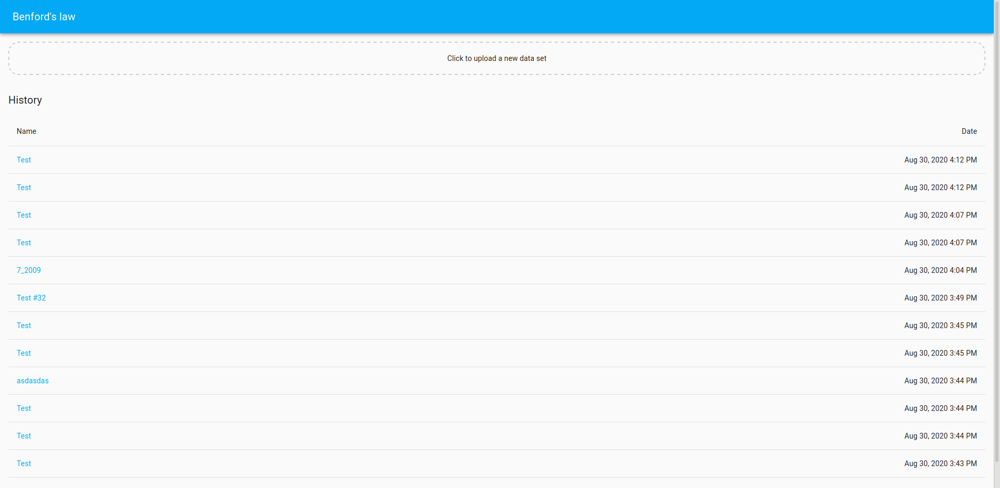
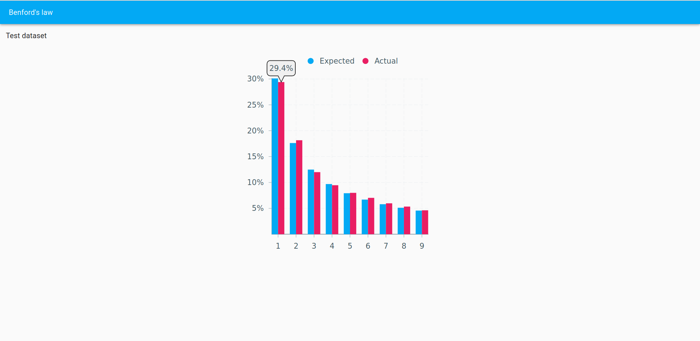

## Benford's law frontend

Simple React app that allows you to verify your dataset against the Benford's law (the first-digit law). 

### App

#### Backend

The app requires backend running to keep historical data in db. 
Visit [benfords-law-backend](https://github.com/dzbrozek/benfords-law-backend) to learn how to run backend server. 

#### Bootstrap

To bootstrap the app run `yarn install` to install all dependencies.

#### Running

To run the app in the development mode call `yarn start`. 
Open [http://localhost:3000](http://localhost:3000) to view the app in the browser.

### Tests

To run tests call `yarn test`
